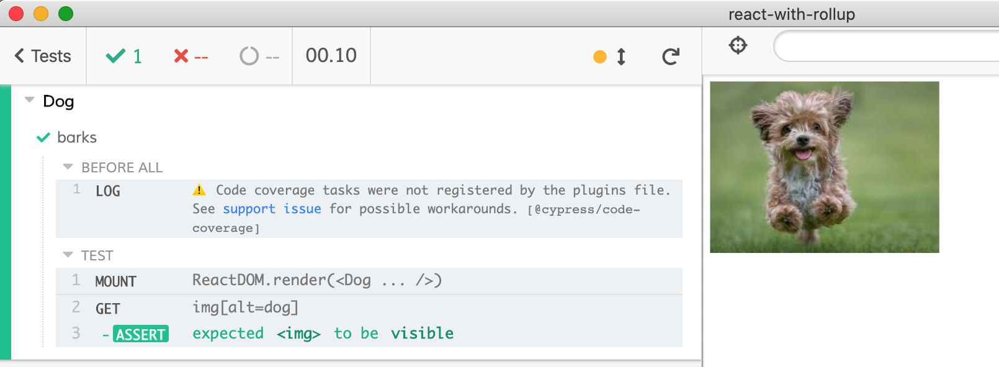

# react-with-rollup
> React application bundled using Rollup and with component tests using [cypress-react-unit-test](https://github.com/bahmutov/cypress-react-unit-test).

Code is bundled using [rollup.config.js](rollup.config.js) file. Component tests point at that file in [cypress/plugins/index.js](cypress/plugins/index.js) file.

```js
const rollupPreprocessor = require('@bahmutov/cy-rollup')
module.exports = (on, config) => {
  on('file:preprocessor', rollupPreprocessor())
}
```

A component test [src/lib/Dog.spec.js](src/lib/Dog.spec.js) mounts `<Dog />`

```js
import {mount} from 'cypress-react-unit-test'
import Dog from './Dog'
it('barks', () => {
  mount(<Dog />)
  cy.get('img[alt=dog]').should('be.visible')
})
```



Original repo forked from [codenaz/create-react-package-tutorial](https://github.com/codenaz/create-react-package-tutorial)
